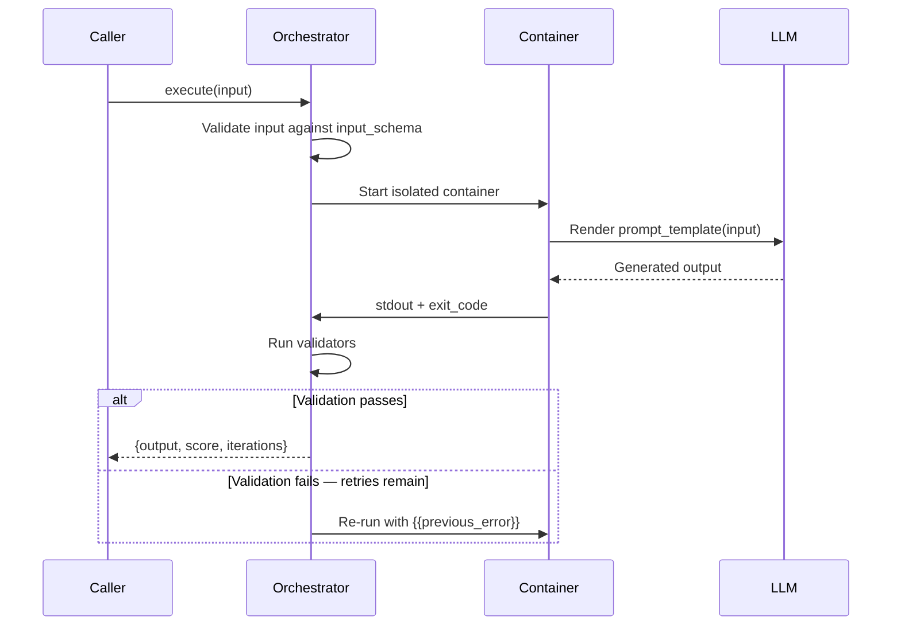
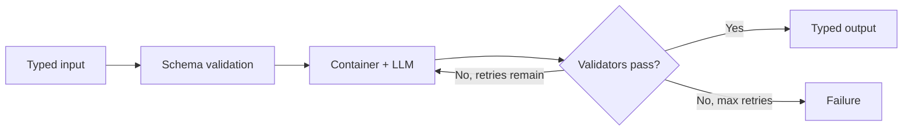
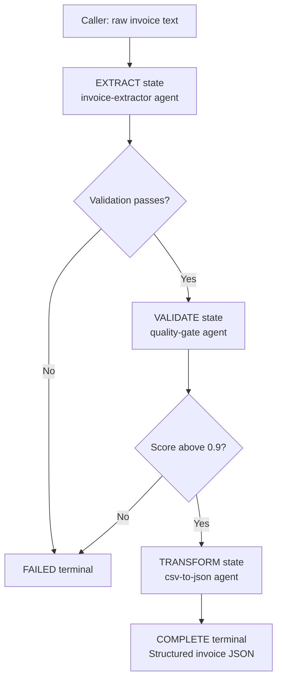

# Agents as Functions

A traditional serverless function takes typed inputs, runs a deterministic algorithm, and returns typed outputs. An AEGIS agent does the same — but the "algorithm" is a language model operating on a declared prompt, isolated in a container, with validated input and output contracts.

From the caller's perspective, invoking an agent is identical to calling a function: pass typed data in, get typed data back, handle failure as an error. The orchestrator manages the container lifecycle, iteration loop, and output validation transparently.

## The Mental Model

| Property | Traditional Lambda | AEGIS Agent |
|---|---|---|
| Runtime | Node.js / Python / etc. | Any language container |
| Input typing | Function signature / Zod | `spec.input_schema` (JSON Schema) |
| Output typing | Return type / schema | `spec.execution.validation[].json_schema` |
| Logic | Deterministic code | LLM + prompt + iteration loop |
| Failure handling | Exceptions / retry config | `max_iterations` refinement loop |
| Composition | Higher-order functions | Workflow FSM states |
| Observability | CloudWatch / OTLP | Domain events + OTLP |

The key shift: instead of writing imperative code to transform inputs into outputs, you write a *prompt* that describes the transformation. The LLM executes it; the validation layer enforces the output contract; the iteration loop handles failures automatically.

## The Invoke → Execute → Return Cycle

When a caller invokes an agent, the orchestrator runs a deterministic outer loop — invisible to the caller — that retries and refines until the output passes validation or retries are exhausted.



Simplified as a flowchart:



### `intent` and `input`

Every agent invocation accepts two optional fields:

| Field | Description |
|---|---|
| `intent` | Optional natural-language steering for the agent. Always available as `{{intent}}` in prompt templates. |
| `input` | Optional JSON data containing typed inputs. Injected as `{{input}}` (full blob) and `{{input.KEY}}` (dot-notation when object) in the prompt template. Must conform to `spec.input_schema` when declared. |

How these combine:

| `intent` | `input` | Rendered prompt |
|---|---|---|
| Present | Present (object) | `{{intent}}` available; `{{input.KEY}}` dot-notation available. |
| Present | Absent | `{{intent}}` available; `{{input}}` is empty. |
| Absent | Present (object) | `{{intent}}` is empty; `{{input.KEY}}` dot-notation available. |
| Absent | Absent | Prompt from `spec.task.instruction` only. |
| Any | Present (string) | `{{input}}` is the raw string; no dot-notation. |

In practice, agents with a declared `input_schema` are typically called with `input` only — the instruction already provides the task context. `intent` is most useful for ad-hoc invocations or when overriding the default instruction at call time.

The caller sees a single response: the final validated output, the iteration count, and a quality score. The retry mechanics are an implementation detail of the execution engine.

## Example 1: Classification Agent

A sentiment classifier is the simplest form of agent-as-function: one text in, one structured label out.

```yaml
apiVersion: 100monkeys.ai/v1
kind: Agent

metadata:
  name: sentiment-classifier
  version: "1.0.0"
  description: "Classifies the sentiment of input text."

spec:
  runtime:
    language: python
    version: "3.11"

  input_schema:
    type: object
    required:
      - text
    properties:
      text:
        type: string
        description: "The text to classify."
      language:
        type: string
        description: "Language of the input text. Default: English."

  task:
    instruction: |
      Classify the sentiment of the provided text as positive, neutral, or negative.
      Return a confidence score between 0.0 and 1.0.

      Respond with valid JSON only:
      {"sentiment": "<positive|neutral|negative>", "confidence": <0.0-1.0>}

  security:
    network:
      mode: none
    resources:
      cpu: 500
      memory: "512Mi"
      timeout: "30s"

  execution:
    mode: one-shot
    validation:
      - type: json_schema
        schema:
          type: object
          required: ["sentiment", "confidence"]
          properties:
            sentiment:
              type: string
              enum: ["positive", "neutral", "negative"]
            confidence:
              type: number
              minimum: 0
              maximum: 1
```

**Invocation:**

```bash
aegis agent run sentiment-classifier \
  --input '{"text": "This product exceeded my expectations."}'
```

**Response:**

```json
{"sentiment": "positive", "confidence": 0.94}
```

## Example 2: Data Extraction Agent

Extraction tasks benefit from iterative refinement — the first attempt may miss fields or produce invalid structure. Setting `mode: iterative` lets the orchestrator feed validation errors back to the LLM for correction.

```yaml
apiVersion: 100monkeys.ai/v1
kind: Agent

metadata:
  name: invoice-extractor
  version: "1.0.0"
  description: "Extracts structured data from invoice text."

spec:
  runtime:
    language: python
    version: "3.11"

  input_schema:
    type: object
    required:
      - document_text
    properties:
      document_text:
        type: string
        description: "Raw invoice text to extract data from."
      currency:
        type: string
        enum: ["USD", "EUR", "GBP"]
        description: "Currency for amount normalization. Default: USD."

  task:
    instruction: |
      Extract structured invoice data from the provided text.
      Return valid JSON with vendor name, total amount, and line items.

  security:
    network:
      mode: none
    resources:
      cpu: 500
      memory: "512Mi"
      timeout: "120s"

  execution:
    mode: iterative
    max_iterations: 3
    validation:
      - type: json_schema
        schema:
          type: object
          required: ["vendor", "total", "line_items"]
          properties:
            vendor:
              type: string
            total:
              type: number
            line_items:
              type: array
              items:
                type: object
                required: ["description", "amount"]
                properties:
                  description:
                    type: string
                  amount:
                    type: number
      - type: semantic
        judge_agent: invoice-amounts-judge
        criteria: "Extracted line item amounts must sum to the reported total."
        min_score: 0.9
```

**Invocation:**

```bash
aegis agent run invoice-extractor \
  --input '{"document_text": "Invoice #1234 from Acme Corp...", "currency": "USD"}'
```

**Response:**

```json
{
  "vendor": "Acme Corp",
  "total": 1250.00,
  "line_items": [
    {"description": "Widget A × 10", "amount": 750.00},
    {"description": "Shipping", "amount": 500.00}
  ]
}
```

The semantic validator runs a child agent (`invoice-amounts-judge`) to confirm the line items sum correctly before accepting the output. If they don't, the orchestrator sends the discrepancy back as `{{previous_error}}` and the LLM corrects it.

## Example 3: Transformation Agent

Transformation agents convert data from one format to another. This example accepts a CSV payload and converts it to structured JSON. The caller can optionally supply the target JSON Schema for the output rows — demonstrating that `input_schema` can carry structured objects, not just scalars.

```yaml
apiVersion: 100monkeys.ai/v1
kind: Agent

metadata:
  name: csv-to-json
  version: "1.0.0"
  description: "Converts CSV content to structured JSON."

spec:
  runtime:
    language: python
    version: "3.11"

  input_schema:
    type: object
    required:
      - csv_content
    properties:
      csv_content:
        type: string
        description: "Raw CSV content to transform."
      delimiter:
        type: string
        description: "Field delimiter character. Default: comma."
      target_schema:
        type: object
        description: "Optional JSON Schema for output rows. When provided, each row is validated against it."

  task:
    instruction: |
      Parse the provided CSV content and convert each row to a JSON object.
      Use the first row as column headers.
      If target_schema is provided, conform each row to that schema.
      Return a JSON array of objects.

  security:
    network:
      mode: none
    resources:
      cpu: 500
      memory: "512Mi"
      timeout: "60s"

  execution:
    mode: iterative
    max_iterations: 3
    validation:
      - type: json_schema
        schema:
          type: array
          items:
            type: object
```

**Invocation with optional target schema:**

```bash
aegis agent run csv-to-json --input '{
  "csv_content": "name,amount,date\nAcme Corp,1250.00,2026-04-01",
  "target_schema": {
    "type": "object",
    "required": ["name", "amount"],
    "properties": {
      "name": {"type": "string"},
      "amount": {"type": "number"}
    }
  }
}'
```

This pattern — where the input payload itself carries a schema — shows the flexibility of typed inputs. The agent adapts its output structure based on caller-supplied data.

## Example 4: Validation Agent

A validation agent acts as a quality gate: it inspects an artifact against a list of criteria and returns a structured verdict. This is commonly used as a `ParallelAgents` workflow state where multiple criteria are checked concurrently.

```yaml
apiVersion: 100monkeys.ai/v1
kind: Agent

metadata:
  name: quality-gate
  version: "1.0.0"
  description: "Evaluates an artifact against a set of quality criteria."
  labels:
    role: judge

spec:
  runtime:
    language: python
    version: "3.11"

  input_schema:
    type: object
    required:
      - artifact
      - criteria
    properties:
      artifact:
        type: string
        description: "The content or output to evaluate."
      criteria:
        type: array
        items:
          type: string
        description: "List of validation rules to apply."
      strict:
        type: boolean
        description: "When true, all criteria must pass. When false, majority pass is sufficient."

  task:
    instruction: |
      Evaluate the provided artifact against each criterion.
      Return a JSON verdict with findings for each criterion.

      Respond with:
      {"verdict": "<pass|fail>", "findings": ["<finding>"], "score": <0.0-1.0>}

  security:
    network:
      mode: none
    resources:
      cpu: 500
      memory: "512Mi"
      timeout: "60s"

  execution:
    mode: one-shot
    validation:
      - type: json_schema
        schema:
          type: object
          required: ["verdict", "findings", "score"]
          properties:
            verdict:
              type: string
              enum: ["pass", "fail"]
            findings:
              type: array
              items:
                type: string
            score:
              type: number
              minimum: 0
              maximum: 1
```

**Invocation:**

```bash
aegis agent run quality-gate --input '{
  "artifact": "SELECT * FROM users WHERE id = '"'"'" + userId + '"'"'",
  "criteria": ["no-sql-injection", "parameterized-queries-only"],
  "strict": true
}'
```

**Response:**

```json
{
  "verdict": "fail",
  "findings": ["String concatenation in SQL query creates injection risk."],
  "score": 0.1
}
```

## Composing Agents into Workflows

Individual agents-as-functions compose into larger pipelines using the workflow FSM. Each workflow state is a function call. Outputs flow between states via the Blackboard.



In this pipeline:

- `{{input.document_text}}` carries the caller's payload into the EXTRACT state.
- `{{blackboard.extract}}` carries the EXTRACT state's output into VALIDATE.
- `{{blackboard.validate}}` carries the VALIDATE verdict into TRANSFORM.

The Blackboard grows as states complete. The caller's input is immutable in `{{input.KEY}}` throughout. See [Workflow Manifest Reference](/docs/reference/workflow-manifest) for full Blackboard and template syntax documentation.

## Calling Agents from Code

The AEGIS SDKs expose agent invocation with the same ergonomics as a library function call.

**Python:**

```python
from aegis import AsyncAegisClient

client = AsyncAegisClient()

result = await client.agents.execute(
    "sentiment-classifier",
    input={"text": "This product exceeded my expectations."}
)

print(result.output)
# {"sentiment": "positive", "confidence": 0.94}
print(f"Completed in {result.iterations} iteration(s)")
```

**TypeScript:**

```typescript
import { AegisClient } from '@100monkeys/aegis-sdk';

const client = new AegisClient();

const result = await client.agents.execute('sentiment-classifier', {
  input: { text: 'This product exceeded my expectations.' },
});

console.log(result.output);
// { sentiment: 'positive', confidence: 0.94 }
console.log(`Completed in ${result.iterations} iteration(s)`);
```

The SDK call returns when the agent completes — whether that took one iteration or five. Errors surface as thrown exceptions with the validation failure details attached.

## When to Use an Agent vs a Workflow

| Scenario | Use |
|---|---|
| Single task with typed input and output | Agent |
| Task that benefits from iterative self-correction | Agent with `mode: iterative` |
| Multi-step pipeline with sequential states | Workflow |
| Branching logic based on output scores | Workflow with score-based transitions |
| Parallel quality gates with consensus | Workflow with `ParallelAgents` state |
| Human approval checkpoint | Workflow with `Human` state |
| One agent's output feeds into another | Workflow (Blackboard threading) |

For workflows, see [Building Workflows](/docs/guides/building-workflows). For multi-agent fan-out and consensus, see the `ParallelAgents` state type in the [Workflow Manifest Reference](/docs/reference/workflow-manifest).
